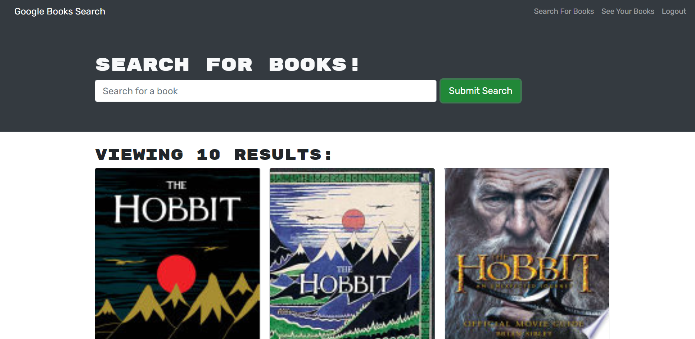

# Book Search Engine

Search for books and keep your searches! Try out this application if you are a book lover! 
## Description
This application helps you to search for books based on your input, and save the book details to your own personal account. Sign Up, and never lose your saved books again (unless you want to delete them!). 

Check out the deployed application [here](https://book-search-engine-bootcamp.herokuapp.com/)!

Before you begin, be sure to sign up for the application. Enter in your email, name, and a secure password. 

Once logged in, you can log in again in the future if the time comes. Meanwhile, go ahead and search for a book! Enter in the name of the book you want to search for and press submit. 

When you find a book that you want to save, click on the save book button, and the details of that book will be stored! You can always view your saved books in the "See Your Books" tab.

If you no longer want a book, you can remove it from your saved books at the click of a button. It's that simple!

## Features
- Users can sign up and log in to keep track of their saved books
- Users can search for a book based on their search input. 
- Users can save multiple books and see their saved books.
- Users can remove saved books when they no longer want them. 
